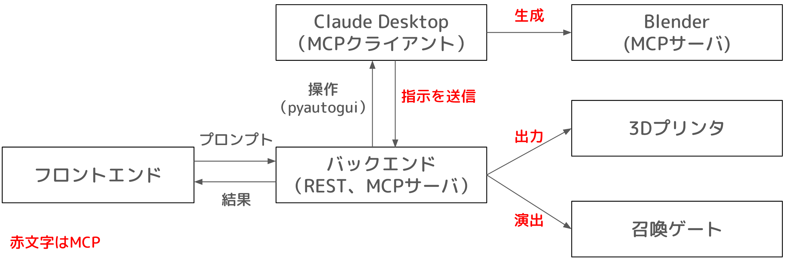

# 作品タイトル
- MCP(Mystic Covenant Pulse) - AI召喚獣バトルゲーム

# 作品のURL
- https://github.com/zakuzakuzaki/mystic-covenant-pulse

# 概要
詠唱（プロンプト）で召喚し、3Dバトル！
本作は、生成AIとBlenderを活用したAI召喚獣バトルゲームです。
ユーザー詠唱を入力すると、[MCP（Model Context Protocol）](https://docs.anthropic.com/ja/docs/claude-code/mcp)を通じてBlenderで召喚獣の3Dモデルを生成。Webアプリ上に出現させます。
さらに指示によってバトル体験が可能です。

# 画像
- 召喚画面のスクリーンショット(プロンプト入力)
- 生成された召喚獣（Blenderもしくは3Dビューワー）
- バトル画面
- 結果表示画面

# 動画
- 召喚から3Dモデル生成までのデモ
- バトルシステムのプレイ動画
- Claude Desktop自動化の様子

# システム構成
## 方針
Claude DesktopがMCPクライアントとして**超優秀**なので、それを活用しています。
ただし、プログラムからClaude Desktopに直接プロンプトなどは渡せません。
そこで、[PyAutoGUI](https://pyautogui.readthedocs.io/en/latest/)を使ってチャット画面にテキストをコピペすることで、プログラムから入力できるようにしています。
さらに、Claude Desktopの結果はMCPを利用して、プログラムに渡されます。

## システム構成図

## バックエンド
- **Python** - FastAPIが簡単にMCP使えるので採用
- **FastAPI** - REST API、MCP サーバー
- **MCP (Model Context Protocol)** - Claude Desktopと連携
- **PyAutoGUI** - GUI操作で、Claude Desktopを操作

## フロントエンド
- **TypeScript**
- **Three.js** - 召喚獣を3Dレンダリング

# 開発素材
- Claude Desktop
- MCP

# タグ
- MCP
- Claude Desktop
- Three.js
- FastAPI
- GUI自動化

# ストーリー
## 開発背景
アイデアは、[MCP ハッカソン by 生成AIハッカソンvol.05](https://mashupawards.connpass.com/event/357647/)の中で生まれました。
MCPと言えば自動化が注目されていますが、それを面白いに全振りした作品を作りたいと考えました。
呪文を詠唱することでキャラクターが現実空間に出現するという没入体験にこだわりました。

## 技術的挑戦
- **GUIによるハッキング** - Claude DesktopをGUI操作で接続しました。
- **チャット指示によるインタラクティブなゲーム体験** - 生成AIを活用して、キャラメイクからバトルまでをできるようにしました。

# メンバー登録
開発者: [開発者名]

# 関連リンク
- https://mashupawards.connpass.com/event/357647

